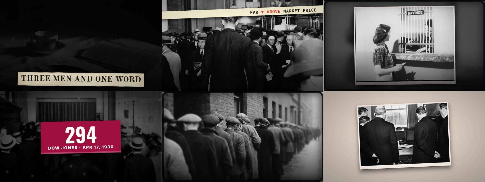
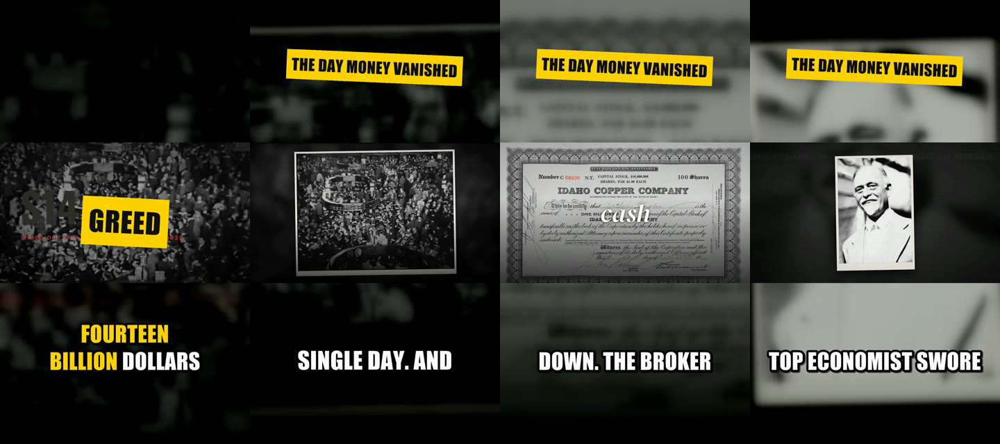
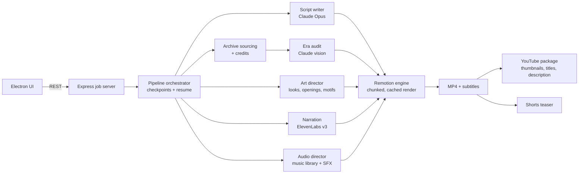
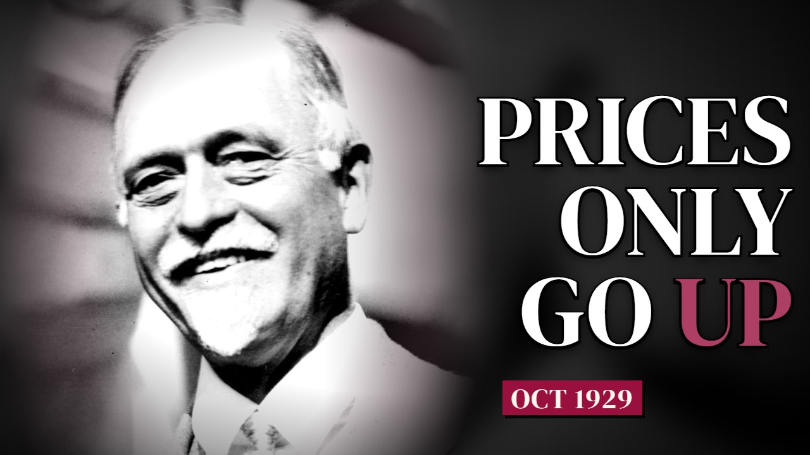

# Nova Studyo

**A desktop app that turns a topic into a finished, publish-ready YouTube documentary.**
Type "The 1929 Crash" and about two hours later there is a 14-minute English documentary on disk: researched script, narration, period-correct archive footage, motion graphics, music and sound design, subtitles, three thumbnails, five title options, a YouTube description with chapters and image credits, plus a vertical teaser Short that sends viewers to the long video.

I built it solo and use it to run my own YouTube channels (finance, war history, "what if" history).

> This repository is a **showcase**: an overview, architecture notes and sample output.
> The source code (~90k lines of JavaScript/TypeScript, 150+ test files) is proprietary and kept in a private repository.
> Code walkthroughs or read access are available to hiring teams on request.

---

## What it does

| Stage | What happens | Built with |
|---|---|---|
| **Research & script** | Plans the story, chapters and a hook; writes narration with voice-acting tags; picks a visual for every beat | Claude Opus (structured JSON output, schema validation, model fallback) |
| **Archive sourcing** | Finds real photographs and film for every scene, keeps license + credit for each one, falls back to AI images only when archive coverage is thin | Openverse / Wikimedia, image generation fallback |
| **Era audit** | A vision model checks each picture against the story's year and rejects anachronisms (no photographs in a 1453 siege, no 1950s cars in 1929) | Claude vision, perceptual hashing for duplicates |
| **Art direction** | Chooses a look, text style, colour grade, opening treatment and topic motif per video, and rotates them across the channel so videos never look templated | Claude + rule-based eligibility checks |
| **Narration** | Natural English narration with word-level timestamps that drive subtitles and edit timing | ElevenLabs v3 |
| **Music & sound** | Picks score from a local, AI-tagged music library by mood, era and culture; places hits, whooshes, ambience and foley on a beat grid; loudness-normalised mix | ffmpeg, custom audio director |
| **Render** | React/Remotion composition with 20+ scene types (maps, counters, charts, headlines, quote cards, document reveals), rendered in cached chunks that survive restarts | Remotion 4, React, TypeScript |
| **YouTube package** | 3 thumbnails rendered from the video's own best frames, 5 titles, description with chapters and credits; thumbnail text is checked for legibility at 320×180 | Claude vision, Remotion stills |
| **Shorts teaser** | Writes a new 45-55 s vertical teaser (not a cut-down): slam-word hook, punchy captions, each line matched to the right shot in the long video, end card to the full documentary | Claude, ElevenLabs, ffmpeg |

## Architecture

More detail in [docs/architecture.md](docs/architecture.md).

## Engineering highlights

- **Reliability over long jobs.** One video is 40+ model calls, hundreds of downloads and a two-hour render. Every stage checkpoints to disk; a crash or a laptop restart resumes where it stopped. Render chunks are cached by a fingerprint of the bundle, so only changed parts re-render.
- **LLM output you can trust.** All model calls use structured JSON with schema validation and repair; when a model is overloaded the call falls back to the next model; spending is tracked per job against a budget.
- **Facts are never invented by the visuals.** The opening planner may only show dates, quotes, headlines or places that are already in the narration or scene data; a treatment that cannot find its facts is not eligible.
- **Quality gates, not just generation.** Era audit, duplicate-image detection, thumbnail legibility checks, loudness normalisation, a design gate that rejects repetitive layouts, and a banned-sound list for effects that sound cheap.
- **Runs on a 16 GB laptop.** Rendering is chunked and memory-aware; local AI models are optional.

## Testing

The application is covered by 150+ test files run with `node:test`: model calls are replaced with stubs, so the suite runs offline and without API keys. Visual changes are reviewed with rendered still frames of every look.

## Tech stack

Electron · Node.js · Express · React · TypeScript · Remotion 4 · ffmpeg · Anthropic Claude (Opus, Sonnet, vision) · ElevenLabs · Openverse / Wikimedia APIs · node:test

## Output

Example videos produced with Nova Studyo:

- *1929: The Crash That Broke the World* (14 min, finance)
- *1453: The Fall of Constantinople* (15 min, history)

---

© Erdem. All rights reserved. This repository contains no source code; nothing here may be copied, modified or redistributed without written permission (see [LICENSE](LICENSE)). Archive images in the sample frames are credited in the published videos' descriptions.
